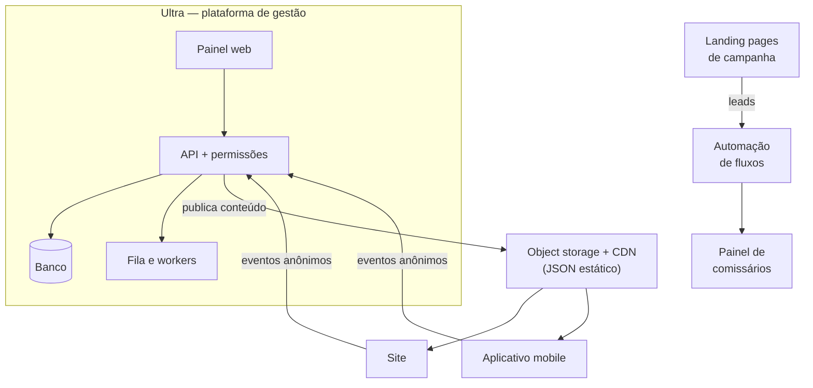

# Portfólio — Jonas Pinheiro

Desenvolvimento e produto digital com foco em **transformar rotinas manuais em sistemas que economizam horas**. Aqui estão os projetos em que atuei numa empresa de entretenimento e produção de eventos ao vivo: o que cada um resolve, como funciona por dentro e o que mudou na prática.

> **Sobre o que você não vai ver aqui.** São sistemas de uma empresa real em produção, então o código-fonte não está publicado. Cada projeto é um estudo de caso com arquitetura, decisões técnicas e alguns trechos de código escolhidos a dedo e reescritos com nomes genéricos. Nome da empresa, marcas, artistas, clientes, domínios e fornecedores foram omitidos ou generalizados de propósito.

---

## Projetos

| # | Projeto | Em uma frase | Meu papel |
|---|---|---|---|
| 1 | [**Ultra** — plataforma de gestão](./projetos/01-plataforma-de-gestao/README.md) | Painel único que unifica cupons, cortesias, conteúdo do site e do app e medição de jornada | Co-idealização, integrações e desenvolvimento |
| 2 | [**Home do aplicativo mobile**](./projetos/02-aplicativo-mobile/README.md) | Tela inicial 100% dirigida por dados, sem publicar versão na loja | Desenvolvimento em equipe |
| 3 | [**Painéis de parceiros comerciais**](./projetos/03-painel-de-comissarios/README.md) | Dois painéis: o dos comissários e o de um festival inteiro, com seis perfis, regras de comissão por perfil e integração direta à bilheteria | Ideação e execução, sozinho |
| 4 | [**Landing pages de campanha**](./projetos/04-landing-pages-de-campanha/README.md) | Páginas de venda e captação, cada uma com a tecnologia certa para o caso | Desenvolvimento |
| 5 | [**Captação de leads pré-venda**](./projetos/05-captacao-de-leads-pre-venda/README.md) | Mais de 11,7 mil cadastros antes da abertura das vendas de um show de estádio, com painel de análise | Concepção, full-stack e dados |
| 6 | [**Hub de venda do festival**](./projetos/06-hub-de-venda-do-festival/README.md) | Programação inteira e checkout direto, com expiração automática de shows | Desenvolvimento |

## O que mudou na prática

| Rotina | Antes | Depois |
|---|---|---|
| Criar cupons para todos os colaboradores | ~3 horas | ~5 minutos |
| Enviar cortesias a parceiros | ~5 horas | ~10 minutos |
| Trocar banner ou destaque na home do site e do app | 40–50 minutos | segundos |
| Saber "quanto eu vendi?" (parceiros) | perguntar no chat, todo dia | consultar o painel |
| Formar base própria antes da venda de um show | depender de mídia paga no dia | 11,7 mil+ cadastros captados antes |

*Tempos aproximados, informados por quem executava cada rotina; não são medição formal. O número de cadastros vem do próprio painel da captação.*

## Como os projetos se conectam

## Stack

| Área | Tecnologias |
|---|---|
| Back-end | TypeScript · Node.js · Fastify · Prisma · Zod · JWT |
| Dados | MySQL · Redis · BullMQ (filas) · PostgreSQL gerenciado (com Row Level Security) · funções de borda |
| Front-end | React · TypeScript · TanStack Start · Vite · Tailwind CSS · shadcn/ui · TanStack Query · React Router |
| Páginas e campanhas | HTML/CSS/JS puros · React · roteamento por arquivos |
| Infra | Object storage + CDN · PaaS para APIs · deploy contínuo · automação de fluxos |

## Como eu trabalho

- **Começo pelo problema, não pela tecnologia.** Cada caso acima parte de uma rotina que custava horas, e a solução só existe se essa conta fechar.
- **Meço antes de confiar.** Vários dos melhores momentos de cada projeto foram um teste que *falhou*: uma fila que travava com o serviço fora do ar, uma média dividida por zero sessões, um verificador que dizia "limpo" com tudo sujo. Descrevo esses casos, não só os acertos.
- **Sou explícito sobre autoria.** Alguns projetos foram feitos em dupla ou em equipe, e em cada estudo de caso está dito o que foi meu e o que não foi.
- **Uso IA como auxiliar de desenvolvimento e de revisão de código.** A decisão de arquitetura, a verificação do resultado e a responsabilidade pelo que vai para produção continuam sendo minhas.

## Sobre este repositório

Este portfólio é protegido por uma verificação automática que roda a cada commit e bloqueia segredos, dados pessoais, URLs fora de uma lista permitida e termos internos. Está em [`scripts/verificar-sensiveis.sh`](./scripts/verificar-sensiveis.sh).

## Contato

LinkedIn: [Jonas Pinheiro](https://www.linkedin.com/in/jonas-pinheiro-a4b949369/)  
GitHub: [JonasFPinheiro](https://github.com/JonasFPinheiro)
