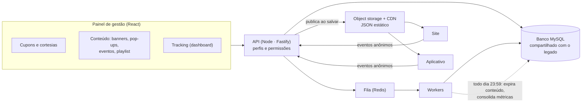

# Ultra — plataforma que unifica a operação digital

> Um painel único que substituiu rotinas espalhadas em vários sistemas: criação de cupons, envio de cortesias, gestão do conteúdo do site e do aplicativo, e medição da jornada do cliente.

**Meu papel:** co-idealização do produto e dos fluxos, definição de requisitos e integrações com as áreas que usam, e desenvolvimento direto de parte dos módulos e de funcionalidades extras (detalhes abaixo). Projeto construído em dupla com outro desenvolvedor.
**Tipo:** sistema interno · monorepo com API e painel web · em produção

---

## O problema

A empresa é uma produtora de entretenimento e eventos ao vivo. Toda a parte digital rodava sobre um sistema de e-commerce legado, e as rotinas do dia a dia eram feitas *dentro* dele:

- **Cupons**: regras difíceis de criar, tela pouco intuitiva, tudo manual e um a um.
- **Cortesias**: enviar ingressos para parceiros exigia repetir a operação para cada pessoa.
- **Home do site e do aplicativo**: qualquer troca de banner ou destaque exigia mexer no sistema legado e gerar um deploy que empurrava os arquivos para o storage. Uma mudança simples virava uma rotina de 40 a 50 minutos, e só dava para fazer de um computador.
- **Sem medição própria**: não havia como saber qual banner convertia, quanto tempo a pessoa ficava, ou até onde rolava a página.

## A solução

O Ultra é uma camada nova **sobre** o sistema legado. Ele não o substitui: usa o mesmo banco e as mesmas contas de usuário, e concentra num só lugar o que antes estava espalhado. Serve como ponte para criar cupons, emitir cortesias, publicar conteúdo e medir resultado.

### Antes e depois

| Rotina | Antes (sistema legado) | Depois (Ultra) |
|---|---|---|
| Criar cupons para todos os colaboradores | ~3 horas | ~5 minutos, criação em massa |
| Enviar cortesias a parceiros | ~5 horas, um a um | ~10 minutos, com lista de envio e regras simples |
| Trocar banner/destaque na home do site ou do app | 40–50 minutos, exigia deploy | segundos, publicação direta, até pelo celular |

*Tempos aproximados, informados por quem executava cada rotina; não são medição formal.*

## Como funciona

**Publicar conteúdo é gravar um JSON.** Ao salvar um banner, a API gera um arquivo JSON e o envia direto ao storage; site e aplicativo leem esse arquivo. Não existe mais deploy no meio do caminho, e o front continua de pé mesmo se a API cair (o app tenta o arquivo primeiro e só usa a API como reserva).

## Módulos

- **Cupons**: criação individual e em lote, com regras por CPF (listas de até dezenas de milhares) e validação.
- **Cortesias**: envio em lote processado de forma assíncrona por fila, com acompanhamento de status de cada lote.
- **Comissários e relatórios**: vínculo de cupom a comissário e relatórios de resultado.
- **Conteúdo do site e do app**: banners, pop-ups (gatilhos: ao carregar a página, após tempo ocioso ou ao clicar em um evento específico, com controle de frequência), próximos eventos, playlist de vídeos, cards de chamada, ícone promocional.
- **Expiração automática**: todo card aceita uma data de validade; uma rotina diária desativa o que venceu e republica o JSON, sem ninguém precisar lembrar.
- **Tracking**: coletor próprio e dashboard (seção abaixo).
- **Permissões**: perfis com acesso por área (ver, criar, editar, excluir). Autenticação compatível com o hash de senha do sistema legado, então ninguém precisou trocar de senha.

## Tracking próprio

O que o sistema entrega hoje: **a jornada do cliente**, do primeiro acesso ao clique, e por consequência dado para decidir e para **vender espaços digitais a marcas**, já que passa a existir número real de alcance e clique por posição.

- **Coletor de ~4 kb**, sem dependência, igual no site e no app. Identidade anônima gerada no navegador, sem dado pessoal.
- **Tempo engajado**: um relógio que só corre com a aba visível. Aba esquecida aberta não vira "retenção".
- **Impressão de verdade**: o elemento precisa ficar 1 segundo contínuo com metade na tela. Passar rolando não conta.
- **CTR por card** (cliques ÷ impressões): separa "o banner é fraco" de "ninguém chega a ver o banner", coisa impossível sem medir impressão.
- **Dashboard**: sessões, únicos, tempo médio, retorno, rejeição, funil de scroll, desempenho por banner/pop-up/evento, origem e dispositivo. Filtro de itens ativos, desativados ou todos.

## Decisões técnicas que valem explicar

**1. Nunca sincronizar o schema automaticamente.** O banco é compartilhado com o sistema legado, que tem dezenas de tabelas que o ORM desconhece. Um `db push` as derrubaria. Toda mudança de banco é um SQL escrito à mão e executado de forma controlada, sempre aditivo.

**2. Não gravar métrica evento a evento.** Com o banco dividido com o e-commerce, volume de analytics poderia derrubar a venda. O coletor manda em lote, a API soma num buffer de 30 s e grava uma vez por janela. Só o agregado vai para o banco relacional.

**3. A fila é proteção, mas quase virou o problema.** Coloquei os lotes numa fila com um único consumidor para o banco ver um lote por vez, por mais instâncias que subam. Ao testar com o Redis fora do ar, **a chamada de enfileirar ficou pendurada por mais de 20 segundos**: o cliente espera a conexão e reconecta para sempre. O lock de gravação nunca liberava e o buffer crescia sem limite, o oposto do objetivo. A correção é só usar a fila se a conexão *já* estiver de pé, com teto de tempo em tudo e espera de 60 s depois de uma falha (medido: 4 s na primeira, ~150 ms nas seguintes). Sem fila, grava direto. [Trecho](./trechos/fila-com-fallback.ts).

**4. Contador incremental erra quando um evento se perde.** Se o `início de sessão` some (recarga de página, lote perdido), o `fim` ainda soma duração e a média sai dividida por menos sessões do que houve — cheguei a ver uma linha com 0 sessões e 1.070 s acumulados. Tudo que é "por sessão" passou a sair da tabela de sessões, que é auto-corretiva, e o resumo diário é **recalculado** (não incrementado), então rodar duas vezes não duplica. [Trecho](./trechos/consolidacao-idempotente.md).

**5. O histórico sobrevive à exclusão, e o nome também.** Um card excluído perdia o rótulo e passava a aparecer como `#4`. Criei um catálogo com o último nome conhecido de cada item, alimentado por três caminhos (gancho antes do DELETE, leitura do painel e varredura noturna) para nenhuma forma de excluir escapar. Enquanto o item existe, a origem manda; depois, o catálogo dá o nome e o status vira "desativado". [Trecho](./trechos/catalogo-de-nomes.ts).

**6. Um bug de fuso que só aparece em produção.** Campos de data sem hora chegam como meia-noite UTC; exibir com o fuso local mostra o dia anterior para quem está em UTC−3. A rotina de expiração usa aritmética fixa de fuso (o país não tem horário de verão) em vez de biblioteca.

## Stack

TypeScript · Node.js · Fastify · Prisma · MySQL · Redis + BullMQ · Zod · JWT
React 19 · React Router · TanStack Query · Tailwind CSS · shadcn/ui · Recharts
Object storage + CDN · PaaS para a API e deploy contínuo para o front

## Trechos de código

Reescritos com nomes genéricos, sem dado real:

- [`fila-com-fallback.ts`](./trechos/fila-com-fallback.ts): fila que degrada com segurança.
- [`catalogo-de-nomes.ts`](./trechos/catalogo-de-nomes.ts): preservar o nome depois de excluir.
- [`coletor-tempo-engajado.js`](./trechos/coletor-tempo-engajado.js): tempo engajado, impressão real e envio que sobrevive ao fechar a aba.
- [`consolidacao-idempotente.md`](./trechos/consolidacao-idempotente.md): resumo diário recalculado.

## O que eu fiz

Fui co-idealizador do produto e dos fluxos, e trabalhei os requisitos e as integrações com quem opera cada rotina (cupons, cortesias, publicação de conteúdo). No código, implementei diretamente o gerenciamento de conteúdo do site e do app, os pop-ups e o ícone promocional, o tracking (coletor, agregação, fila, catálogo e dashboard) e boa parte das telas do painel. Nos módulos de cupons e cortesias, a base foi implementada principalmente pelo outro desenvolvedor a partir do desenho que definimos juntos, e eu acrescentei funcionalidades que aceleram a operação: **criação de vários cupons de uma vez, seleção de todos os eventos de uma categoria, criação de cortesias em lote e designação em lote**.
