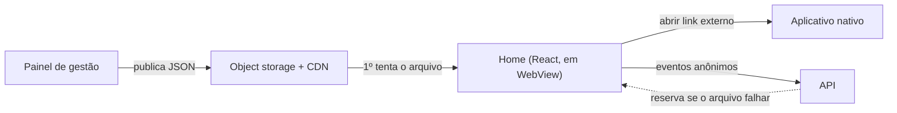

# Home do aplicativo mobile

> A tela inicial do aplicativo de ingressos: 100% dirigida por dados vindos do painel de gestão, sem publicar nova versão na loja para trocar conteúdo.

**Meu papel:** desenvolvimento em equipe com outro desenvolvedor: lista de eventos, reorganização da home, instrumentação de métricas, correções de dados e limpeza de seções.
**Tipo:** aplicação web mobile-first rodando dentro do aplicativo nativo (WebView) · em produção

---

## O problema

Trocar qualquer coisa na home do aplicativo (um banner, um evento em destaque, a ordem das seções) dependia de uma rotina manual e demorada. O aplicativo precisava de uma home que mudasse na hora, sem passar pela loja de aplicativos e sem depender de um desenvolvedor para cada ajuste de campanha.

## A solução

A home é uma aplicação web que roda dentro do aplicativo nativo. Ela não tem conteúdo escrito no código: tudo vem de arquivos JSON publicados pelo [painel de gestão](../01-plataforma-de-gestao/README.md). O time de marketing edita no painel, publica, e a home já reflete.

## O que a home tem

- **Banners em carrossel** e **stories de artistas**: o avatar abre vídeos em sequência, carregados só quando a pessoa toca.
- **Próximos eventos** e **destaques da semana**, em trilhos horizontais.
- **"Qual ritmo você está buscando?"**: filtro por gênero e lista de eventos com selo de data, miniatura em proporção de banner e local.
- **Galeria de fotos**, **pop-up** de campanha e **ícone promocional** flutuante.
- **Busca**, que entrega o termo ao aplicativo nativo.

## Decisões técnicas

**Arquivo primeiro, API como reserva.** A camada de dados tenta o JSON estático no CDN e só cai na API se ele falhar. A home continua carregando mesmo com a API fora do ar, e as várias telas que precisam do mesmo arquivo compartilham uma única requisição em andamento.

**A imagem certa, e não a que veio no campo.** Um campo preenchido à mão em cada produto às vezes trazia uma imagem quadrada, que aparecia cortada e "quebrada" na lista. A imagem widescreen correta estava na galeria do produto, identificada por um ID de anexo. A API passou a resolver isso e expor um campo já correto, e a home o prioriza, com o antigo como reserva.

**Um erro que não dava erro.** Em desenvolvimento, a lista aparecia vazia sem nenhuma mensagem útil. Era o bloqueio de CORS do storage, que só libera origens específicas: rodar o projeto em outra porta bastava para o navegador descartar a resposta. Aprendizado: erro de rede silencioso precisa de um teste explícito de origem.

**Comunicação com o nativo por mensagem.** Abrir um link externo, buscar ou acionar uma ação passa por `postMessage` para o aplicativo, com um caminho alternativo (`window.open`) quando roda no navegador.

## Métricas

Cada card e cada seção carregam um identificador de rastreamento. O mesmo coletor do site mede impressões e cliques, o que permite saber qual gênero é mais filtrado, quais termos são buscados e quais seções chegam a ser vistas de fato. Detalhes no [caso da plataforma](../01-plataforma-de-gestao/README.md#tracking-próprio).

## Stack

React 19 · Vite · Tailwind CSS · JavaScript
Camada de dados própria (cache de requisição e reserva) · Lucide (ícones)
Object storage + CDN · deploy contínuo
