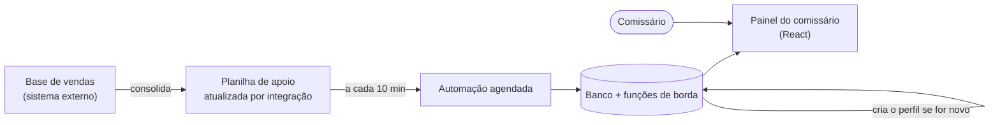

# Painéis de parceiros comerciais

> Dois painéis, em duas escalas. O primeiro acabou com a pergunta diária "quanto eu vendi?" para os comissários. O segundo evoluiu a ideia para um festival inteiro: seis tipos de parceiro, regras de comissão diferentes por perfil e integração direta com a bilheteria.

**Meu papel:** ideação e execução por conta própria, do problema ao produto no ar, nos dois painéis.
**Tipo:** aplicações web com integração automática de dados · em produção

---

## O problema (comum aos dois)

Parceiros vendem ingressos com um **cupom de desconto próprio** e recebem comissão ou bonificação sobre isso. O número de vendas e o valor a receber ficavam do lado de quem contratava, e a única forma de o parceiro saber "quanto eu vendi?" era perguntar.

O resultado era um fluxo diário de mensagens num aplicativo de conversa:

- *"Quanto eu vendi?"*
- *"Quanto tenho de comissão para receber?"*
- *"Esse número está mesmo certo?"*

Cada pergunta consumia tempo de quem respondia, gerava dúvida sobre a confiabilidade dos números, e o mesmo dado tinha de ser recomposto à mão toda vez.

---

## Painel 1 · Comissários

O primeiro painel resolve o caso mais simples: o comissário entra e vê o próprio resultado. O acesso nasce do cupom, sem cadastro manual, e os números se atualizam sozinhos.

- **Perfil automático**: comissário novo aparece no sistema sem ninguém cadastrar.
- **Visão completa**: total vendido, faturamento e comissão, sempre atualizados.
- **Uma fonte só**: comissário e quem contrata olham o mesmo número.
- **Acabam as perguntas diárias**, e junto com elas o retrabalho de responder.

**A primeira versão da autenticação era simples demais.** Uma revisão do código, com apoio de IA, mostrou senha em texto no banco, políticas de acesso abertas a qualquer visitante e um "administrador" definido por um nome de cupom. Corrigi: senha guardada pelo sistema de contas (criptografada), cada comissário lê só os próprios números, acesso anônimo revogado e administrador como permissão de verdade. Contar isso aqui é proposital: encontrar e consertar antes de virar incidente também é parte do trabalho.

---

## Painel 2 · Parceiros do festival

O segundo painel nasceu do primeiro e cresceu para um festival com dezenas de datas ao longo de quatro meses. Agora são vários tipos de parceiro, cada um com regras de remuneração próprias, e a gestão precisa enxergar tudo junto.

### O que ele entrega

- **Seis tipos de perfil**, cada um com regras próprias: comissários, atléticas, empresas júnior, influenciadores, colaboradores internos e ações de venda.
- **Comissão escalonada** só para um dos perfis, com faixas definidas pelo volume de ingressos elegíveis e pela categoria do show. Os demais perfis recebem bonificação em faixas por volume, em consumo e cortesias.
- **Visão do parceiro**: ingressos, faturamento gerado, comissão a receber, posição no ranking e próximos marcos de bonificação.
- **Visão da gestão**: tudo consolidado, com filtro por tipo de perfil, ranking geral e a opção de **ver o painel exatamente como o parceiro vê**, sem sair da sessão de administrador.
- **Módulo de análise de campanhas** para mídia paga, que não gera comissão e tem tela própria de retorno: formulário em quatro etapas que calcula CTR, CPC, CPM, conversão, CPA, ticket médio e ROAS, compara cada indicador com a linha de base e a meta, mostra um semáforo e permite sobrescrever qualquer valor.

### Decisões técnicas

**A regra de cálculo mora no banco, não na tela.** Comissão, faixas e ranking são *views*. A fonte da verdade é única e auditável, e a interface só exibe. Mudar uma regra é mudar um lugar. A taxa de serviço da bilheteria sai da base antes do cálculo, para o parceiro ser remunerado só sobre o valor do produto.

**Integração direta no lugar de planilha.** A versão anterior lia uma planilha alimentada por integração, via automação agendada. Funcionou até o volume passar do limite de leitura. Foi substituída por uma função de borda que consulta a API da bilheteria, varre os produtos do festival, filtra pela agenda oficial, concilia cupons e shows e grava totais consolidados, totais por show e a curva diária. Roda de hora em hora, com **modos de simulação e diagnóstico** para validar antes de gravar.

**Normalização na entrada.** Acentuação corrompida corrigida, cupons padronizados, shows casados por identificador e por nome, com deduplicação.

**Papéis em tabela separada.** Quem é administrador está numa tabela de papéis própria, consultada por uma função em schema privado, o padrão que evita escalada de privilégio. Row Level Security em todas as tabelas.

**Autenticação sem e-mail real.** O parceiro entra com o cupom, convertido internamente em credencial. No primeiro acesso ele confirma o cupom e define a senha definitiva.

### Problemas que apareceram e como resolvi

- **Ingressos e faturamento não batiam**, porque vinham de fontes diferentes. Passei a calcular ambos da mesma fonte consolidada.
- **Comissão inflada**, por a taxa de serviço estar dentro da base. Passou a ser removida antes do cálculo.
- **Leitura bloqueada** por políticas de segurança com escopo errado e, no sentido contrário, **ranking visível para quem não era administrador**. Refeitas por papel.
- **Criação em lote de mais de cem contas** de parceiros, feita por função administrativa em vez de à mão.

---

## Stack

React · TypeScript · Vite · Tailwind CSS · shadcn/ui · TanStack Query · React Hook Form · Zod
PostgreSQL gerenciado · autenticação · Row Level Security · funções de borda (Deno) · execução agendada · integração REST
Automação de fluxos no painel 1
Interface construída com plataforma assistida por IA; definição do produto, regras, modelagem de dados, segurança e integração conduzidas por mim.
