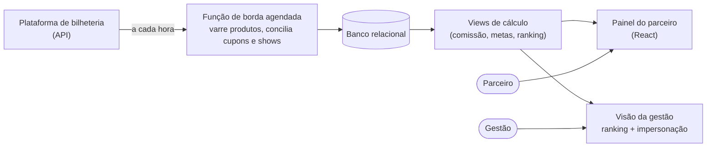

# Painel de parceiros comerciais

> Plataforma que acompanha, em tempo quase real, as vendas de cada parceiro comercial de um festival de música: quanto vendeu, quanto tem a receber, em que posição está e qual é o próximo marco de bonificação.

**Meu papel:** ideação e execução por conta própria, do problema ao produto no ar.
**Tipo:** aplicação web com integração automática de dados · em produção

---

## O problema

Cada parceiro (comissário, atlética universitária, empresa júnior, influenciador, colaborador interno) vende ingressos com um **cupom de desconto próprio** e recebe comissão ou bonificação sobre isso. O número de vendas e o valor a receber ficavam do lado de quem contratava, e a única forma de o parceiro saber "quanto eu vendi?" era perguntar.

O resultado era um fluxo diário de mensagens num aplicativo de conversa:

- *"Quanto eu vendi?"*
- *"Quanto tenho de comissão para receber?"*
- *"Esse número está mesmo certo?"*

Cada pergunta consumia tempo de quem respondia, gerava dúvida sobre a confiabilidade dos números, e o mesmo dado tinha de ser recomposto à mão toda vez.

## A solução

Um painel em que o próprio parceiro entra e vê o seu resultado. O acesso nasce do cupom, sem cadastro manual, e os números se atualizam sozinhos a partir da plataforma de bilheteria. A gestão enxerga tudo consolidado, com ranking e filtros por tipo de parceiro.

## O que ele entrega

- **Seis tipos de perfil**, cada um com regras próprias de remuneração: comissários, atléticas, empresas júnior, influenciadores, colaboradores internos e ações de venda.
- **Visão do parceiro**: ingressos vendidos, faturamento gerado, comissão a receber, posição no ranking e próximos marcos de bonificação.
- **Visão da gestão**: tudo consolidado, com filtro por tipo de perfil, ranking geral e a opção de **ver o painel exatamente como o parceiro vê**, sem sair da sessão de administrador.
- **Módulo de análise de campanhas**: formulário em quatro etapas (identificação, status anterior, ações internas e resultados) que calcula CTR, CPC, CPM, conversão, CPA, ticket médio e ROAS, compara cada indicador com a linha de base e a meta, mostra um semáforo de status e permite sobrescrever qualquer valor à mão.
- **Uma fonte só**: parceiro e gestão olham o mesmo número, então "esse valor está certo?" deixa de existir.
- **Acabam as perguntas diárias**: o fluxo de mensagens sobre "quanto eu vendi" some, e junto com ele o retrabalho de responder.

## Decisões técnicas

**A regra de cálculo mora no banco, não na tela.** Comissão, faixas e ranking são *views*. A fonte da verdade é única e auditável, e a interface só exibe. Mudar uma regra é mudar um lugar. A taxa de serviço da bilheteria sai da base antes do cálculo, para o parceiro ser remunerado só sobre o valor do produto.

**Integração direta no lugar de planilha.** A primeira versão lia uma planilha alimentada por integração, via automação agendada a cada 10 minutos. Funcionou até o volume passar do limite de leitura. Foi substituída por uma função de borda que consulta a API da bilheteria, varre os produtos do festival, filtra pela agenda oficial, concilia cupons e shows e grava totais consolidados, totais por show e a curva diária. Roda de hora em hora, com **modos de simulação e diagnóstico** para validar antes de gravar.

**Normalização na entrada.** Acentuação corrompida corrigida, cupons padronizados, shows casados por identificador e por nome, com deduplicação.

**Autenticação sem e-mail real.** O parceiro entra com o cupom, que é convertido internamente em credencial. No primeiro acesso ele confirma o cupom e define a senha definitiva. A senha fica com o sistema de contas, criptografada.

**Papéis em tabela separada.** Quem é administrador está numa tabela de papéis própria, consultada por uma função em schema privado, o padrão que evita escalada de privilégio. Cada parceiro só lê os próprios números (Row Level Security em todas as tabelas), e não existe acesso anônimo.

## Problemas que apareceram e como resolvi

- **Ingressos e faturamento não batiam**, porque vinham de fontes diferentes. Passei a calcular ambos da mesma fonte consolidada.
- **Comissão inflada**, por a taxa de serviço estar dentro da base. Passou a ser removida antes do cálculo.
- **Leitura bloqueada** por políticas de segurança com escopo errado, e o inverso: **ranking visível para quem não era administrador**. Refeitas por papel.
- **A primeira versão da autenticação era simples demais.** Uma revisão do código (com apoio de IA) mostrou senha em texto no banco, políticas abertas a qualquer visitante e um "administrador" definido por um nome de cupom. Corrigi: senha no sistema de contas, leitura restrita ao próprio parceiro, acesso anônimo revogado e administrador como permissão de verdade. Contar isso aqui é proposital: encontrar e consertar antes de virar incidente também é parte do trabalho.
- **Criação em lote de mais de cem contas** de parceiros, feita por função administrativa em vez de à mão.

## Stack

React · TypeScript · Vite · Tailwind CSS · shadcn/ui · TanStack Query · React Hook Form · Zod
PostgreSQL gerenciado · autenticação · Row Level Security · funções de borda (Deno) · execução agendada · integração REST
Interface construída com plataforma assistida por IA; definição do produto, regras, modelagem de dados, segurança e integração conduzidas por mim.
