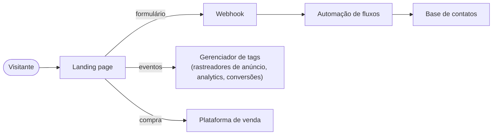

# Landing pages de campanha

> Uma linha de páginas de venda e captação para campanhas de curta duração: hub de venda do festival, captação pré-venda, day use, áreas premium e corrida temática.

**Meu papel:** desenvolvimento das páginas, da estrutura visual à captação e à medição.
**Tipo:** páginas em produção, uma por campanha. Duas têm estudo de caso próprio.

---

## O problema

Campanhas de evento têm janela curta e identidade própria. Cada uma precisa ir ao ar rápido, parecer com o evento (e não com um template genérico), funcionar bem no celular, capturar o contato de quem se interessa e permitir medir o que converteu.

## A solução

Em vez de um único template, um repertório: cada campanha usa **a menor tecnologia que resolve o caso**, e todas compartilham as mesmas regras de qualidade.

| Campanha | Objetivo | Abordagem |
|---|---|---|
| Day use | Vender ingressos de day use e de domingos temáticos | HTML, CSS e JavaScript puros, sem framework |
| Áreas premium | Captar interesse em experiências de alto valor | React + Vite + Tailwind, formulário validado, back-end gerenciado |
| Corrida temática | Apresentar o produto e direcionar à inscrição | Página única em HTML, leve e sem dependência |
| Hub de venda do festival | Vender ingressos de dezenas de shows | React + Vite, programação tipada, filtros e expiração automática. [Estudo de caso](../06-hub-de-venda-do-festival/README.md) |
| Captação pré-venda | Formar base própria antes da abertura das vendas | React com SSR, painel administrativo e mais de 11,7 mil cadastros. [Estudo de caso](../05-captacao-de-leads-pre-venda/README.md) |

## Regras que sigo em todas

- **Mobile primeiro**: estilos base pensados para tela pequena, ampliados por `min-width`; alvos de toque de 44 px; campos de formulário com fonte de no mínimo 16 px para evitar o zoom automático do iOS.
- **Identidade por contexto**: cada evento tem paleta, tipografia e tom próprios. Uma campanha de lazer diurno é clara e colorida; um show é escuro e cinematográfico; uma área premium é sóbria e dourada.
- **Captação sem atrito**: nome, telefone e e-mail; mensagem de sucesso na própria tela, sem redirecionar.
- **Medição por um único ponto**: rastreadores de anúncio, analytics e conversões ficam centralizados num gerenciador de tags, então o marketing configura sem tocar no código.
- **Acessibilidade e desempenho**: contraste mínimo 4,5:1, foco visível, `alt` nas imagens, imagens carregadas sob demanda e fontes limitadas a duas famílias.

## Decisões técnicas

**Escolher a ferramenta pelo caso, não pelo hábito.** Uma página de corrida com uma dobra de conteúdo não precisa de framework; uma de captação com formulário validado e várias seções se beneficia de componentes. A regra foi sempre partir do mais simples e só subir de complexidade com motivo.

**O formulário é o ponto crítico.** É onde o dinheiro da campanha vira contato. Validação no cliente com esquema (sem dependência de mensagem de servidor), feedback imediato e envio por webhook, sem depender de back-end próprio.

## Benefício

Campanhas no ar rapidamente, com aparência própria, boa experiência no celular e captação medida, sem depender de um sistema pesado para páginas que vivem poucas semanas.

## Stack

HTML · CSS · JavaScript
React · TypeScript · Vite · Tailwind CSS · Radix UI / shadcn · React Hook Form · Zod · TanStack Query / Start
Deploy contínuo para o front-end
