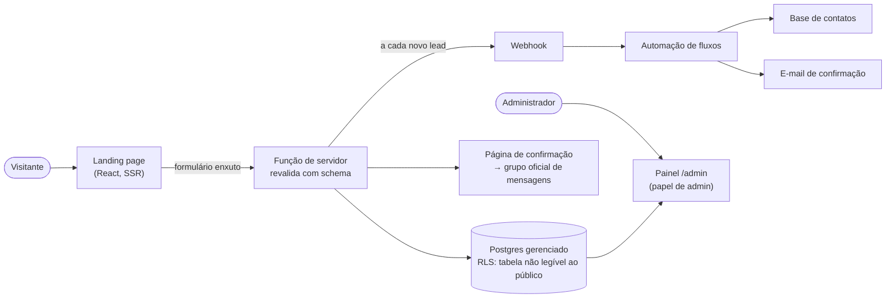

# Captação de leads pré-venda

> Landing page que transforma a expectativa por um show de grande porte em **base própria de contatos**, antes da abertura das vendas. Mais de **11,7 mil cadastros** captados antes do dia da venda.

**Meu papel:** concepção da jornada, direção de arte a partir do material de marca, desenvolvimento full-stack, modelagem e segurança dos dados, integrações de marketing e painel de análise.
**Tipo:** aplicação web com back-end gerenciado e painel administrativo · em produção

---

## O problema

Em um show de estádio, o dia da abertura de vendas concentra a demanda, e quem depende só de mídia paga naquele dia paga caro por atenção que poderia já ser sua. A empresa precisava **avisar o público na hora certa** e **aquecê-lo antes**, sem depender de anúncio para ser lembrada.

## A solução

Uma página cujo único trabalho é captar o cadastro. Quem se registra recebe aviso antecipado da venda, informações em primeira mão e preço exclusivo, e passa a ser um contato próprio da empresa.

**Resultado:** mais de 11,7 mil cadastros antes da abertura das vendas, uma base que reduz a dependência de mídia paga no dia da venda.

## Decisões que mais pesaram

**Formulário logo na primeira dobra e enxuto de propósito.** Nome, e-mail e telefone, mais o consentimento de privacidade. Cada campo a mais custa conversão, então nada além do necessário para avisar a pessoa.

**A confirmação continua a conversa.** Depois do envio, uma página de confirmação com um botão de destaque, acima da dobra, leva ao grupo oficial de mensagens, onde a comunicação segue sem depender de anúncio.

**Validação nas duas pontas.** Zod no cliente e de novo no servidor, com bloqueio de cadastro duplicado e teclado numérico automático nos campos de telefone e documento no celular.

**A tabela de leads não é pública.** Row Level Security: ninguém lê a tabela direto do navegador. A gravação passa por uma função de servidor que revalida com o schema. O painel só abre para usuários com **papel de administrador guardado em tabela separada de papéis**.

## Painel administrativo

Acesso restrito por autenticação e papel, com a mesma identidade visual da página. Mostra:

- total de cadastros, cadastros por dia desde o início e curva de progressão acumulada;
- detalhamento hora a hora ao clicar em um dia;
- distribuição por gênero, cidade e estado;
- **insights automáticos**: melhores e piores horários de captação, janela de pico, melhor dia da semana, ritmo semanal e alcance fora da cidade-sede;
- exportação da base em CSV para o time comercial.

Toda leitura é paginada para não esbarrar nos limites de consulta do banco.

## Direção de arte e desempenho

A página foi construída a partir do material de marca do projeto (arquivo de layout e vetorial da arte-chave): telas cheias alternando fundo claro e escuro, tipografia condensada de alto impacto, mapa da cidade como fundo em baixa opacidade e os ornamentos do manual de marca. As imagens de fundo passaram por otimização própria: ampliação para 4K, conversão para WebP e composição em módulos, para não perder nitidez em telas grandes.

Mobile primeiro, tipografia fluida, metadados próprios de SEO e de compartilhamento social, animações discretas de entrada.

## Integrações

- **Rastreador de anúncios** com visualização de página e evento de *lead* disparado na confirmação do cadastro.
- **Webhook para automação de fluxos** a cada novo lead, alimentando a base de contatos e um e-mail de confirmação com template próprio, seguindo a identidade do projeto.
- **Grupo oficial de mensagens** como canal pós-cadastro.

## Stack

React · TanStack Start (SSR e funções de servidor) · Vite · Tailwind CSS · TypeScript · Zod
Postgres gerenciado com Row Level Security e autenticação por papéis
