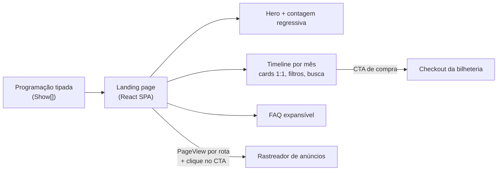

# Hub de venda do festival

> Landing page que reúne a programação inteira de um festival de música e leva cada show direto ao checkout, com foco total em conversão. Programação com cerca de 27 shows ao longo de quatro meses, sem manutenção manual para tirar do ar o que já passou.

**Meu papel:** desenvolvimento e evolução contínua da página, trabalhando de forma iterativa com o cliente interno, em produção.
**Tipo:** aplicação web de página única (SPA) · em produção

---

## O problema

Um festival com dezenas de datas espalhadas por meses precisa de um lugar em que o público veja a programação, encontre o show que quer e compre em poucos toques. Manter isso à mão, tirando cada show do ar depois que acontece e mudando tags e ingressos esgotados, é um trabalho que só cresce.

## A solução

Um hub de venda: **cada show é um card que leva direto ao checkout** da plataforma de bilheteria. Toda a programação vive em uma única camada de dados tipada, então atualizar o festival é editar um arquivo.

## O que a página tem

- **Hero de vendas** com contagem regressiva para a abertura, selo de urgência e botões de navegação rápida.
- **Timeline de shows agrupada por mês**, com um card 1:1 por data: banner do artista, dia da semana, horário de abertura dos portões, gêneros e chamada de compra.
- **Filtros por gênero musical** (13 gêneros, cada um com cor própria) e **busca por artista em tempo real**.
- **Sistema de tags** nos cards (por exemplo, "Infantil" e "Esgotado"), cada uma com cor e regra própria.
- **Páginas secundárias**: uma de atividades esportivas com identidade visual própria e outra de combos promocionais.
- **FAQ completo e expansível**, com links clicáveis e rolagem suave a partir do hero, cobrindo ingressos, meia-entrada solidária, classificação etária, acessibilidade e transferências.
- Régua de patrocinadores, rodapé institucional e metadados de compartilhamento social.

## Decisões técnicas

**Expiração automática.** Um show sai da programação sozinho à meia-noite do dia seguinte, com o cálculo feito no fuso horário local, não no do navegador nem no do servidor. Sem manutenção manual e sem card de show que já passou.

**Design system por tokens semânticos.** A paleta muda por mês do festival (uma cor por mês), definida como tokens no Tailwind. Trocar a identidade de um mês é trocar um token, não caçar cores nos componentes.

**Uma única fonte de dados tipada.** Os cards, os filtros, a busca e a expiração leem o mesmo `Show[]`. Um campo faltando vira erro de compilação, não card quebrado em produção.

**Medição que acompanha a navegação.** Como é uma SPA, a visualização de página é disparada a cada troca de rota, e cada clique em um CTA de compra vira evento. Sem isso, o rastreador só veria a primeira página.

**Cupom persistente.** Um hook próprio guarda o cupom de desconto da pessoa durante a navegação, para ele chegar ao checkout.

## Benefício

Um ponto único de venda que se cuida sozinho durante a temporada, com foco em conversão e em experiência boa no celular.

## Stack

React 18 · TypeScript · Vite · Tailwind CSS · shadcn/ui · Radix · React Router · TanStack Query
Deploy contínuo com domínio próprio
